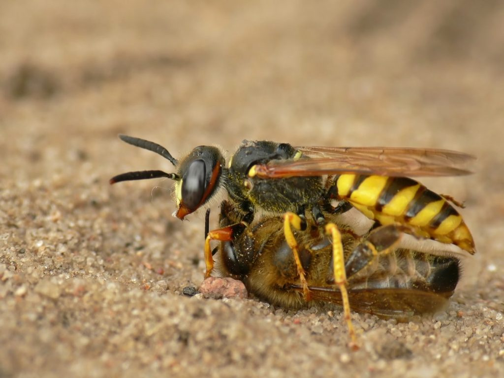

# Wasps vs Bees

Bienen sind unerlässlich für unser Ökosystem. In unserem Ökosystem sind Bienen zu 80% zum Bestäuben unserer Wild- und Nutzpflanzen verantwortlich. Allerdings sind Bienen auch vom Aussterben bedroht und gelten als besonders geschützte Lebewesen. 
Wespen und Bienen kommen gerne aneinander. Angelockt vom Honig der Bienen versuchen diese in den Bienenstock einzudringen und dabei kommt es zu einem Kampf zwischen Bienen und Wespen, wobei eine Wespe einer Biene grundsätzlich überlegen ist. Als Imker ist es wichtig Bienen vor Wespen zu schützen. Dabei spielt die Erkennung von Wespen und rechtzeitige Maßnahmen eine große Rolle um die Bienenvölker zu schützen. Deep Learning würde sich hierbei anbieten, um Wespen frühzeitig zu Erkennen.

Hierfür wurde folgender Datensatz von Kaggle benutzt:
Datensatz:
- <https://www.kaggle.com/jerzydziewierz/bee-vs-wasp>

Quellen:
- <https://www.badenova.de/blog/bienen-und-ihre-umweltbedeutung/>
- <https://www.bund.net/themen/tiere-pflanzen/wildbienen/bedrohung-schutz/>
- <https://www.bussgeldkatalog.org/tierschutz-biene/>

Bildquelle:
- <https://www.gartenbau.org/magazin/unterschied-biene-wespe-201917314>

Es wurden 3 Modelle verwendet mit Ergebnissen auf den Testdatensatz:
- VGG16: 92.81% + Hoher Recall auf allen Klassen (0.93, 0.82, 0.75, 0.84)
- ResNet50: 92.14% + Hoher Recall auf allen Klassen (0.92, 0.77, 0.76, 0.84)
- Fully Convolutional Neural Network: 88.94% (0.86, 0.62, 0.64, 0.81)